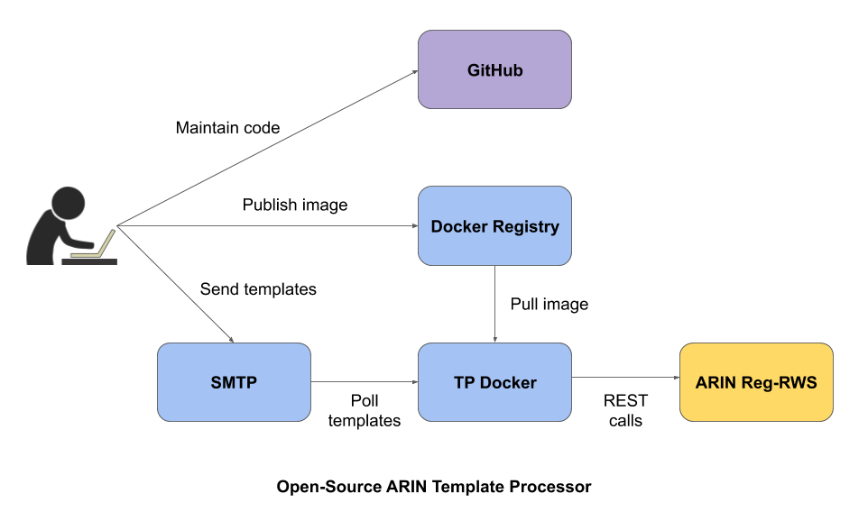

Open-source ARIN Template Processor
-----------------------------------

## Overview

This open-source software can help you provide network reassignment/reallocation information to ARIN, using traditional
email templates. You just send email templates to an email server that you run, and this software converts and submits
them to ARIN, using ARIN's RESTful API.

## Introduction

Open-source ARIN Template Processor (TP) allows you to process various ARIN email templates yourself while interacting
with the SMTP (Simple Mail Transfer Protocol) service you operate and with the Registration RESTful Service
([Reg-RWS](https://www.arin.net/resources/manage/regrws/quickstart)) that ARIN operates. This system is shown in the
following figure.

To use the TP, you send an email message containing a completed, supported ARIN template (see
**Appendix A: Supported Templates**) to a configured mailbox. The TP polls that mailbox every minute for new messages
and then interacts with Reg-RWS to process those messages. The TP then sends success/failure email messages to your
mailbox. For email messages that contain unsupported templates or are malformed (for example, that contain a bad `From`
address), the TP simply logs the details of those messages for you to review.

This document next describes how to build, run, and further develop the TP software.

## Requirements

To use the software, you must have the [API key](https://www.arin.net/reference/materials/security/api_keys/) for an
ARIN Online user account.

Before building the TP software, install:
* [Git](https://git-scm.com/downloads)
* [Java 11 or higher](https://jdk.java.net/)
* [Docker Engine](https://docs.docker.com/engine/)

This software has been tested with [OpenJDK 11](https://openjdk.java.net/projects/jdk/11/). It is expected to work with
higher versions of Java, including from Oracle.

## Building the TP Software

**Step 1:** Get the source code by entering the following commands in your terminal window:

    git clone https://github.com/arineng/arin_template_processor.git
    cd arin_template_processor

**Step 2:** Build the software by entering the following command:

    ./gradlew clean build

This command builds and tests the software. It produces a `template_processor` web archive (WAR) file in the
`template_processor/build/libs` directory.

To omit tests when building the software, use the following command:

    ./gradlew clean build -PskipTests=true

## Building the Docker Image

**Step 1:** Build the Docker image for the TP (see the `Dockerfile` for [details](./Dockerfile)) by entering the
following command:

    docker build -t NAME[:TAG] .

See [the Docker documentation](https://docs.docker.com/engine/reference/commandline/tag/) for tag details.

**Step 2:** The built Docker image can optionally be pushed to a remote Docker registry. To push the image to a remote
registry:

I. Log into the Docker registry by entering the following command:

    docker login SERVER

II. Push the image by entering the following command:

    docker push NAME[:TAG]

The TP Docker image is then pushed to your remote Docker registry.

If step 2 is skipped, the built Docker image is only available locally on your machine.

See **Appendix B: Building the Docker Image Using Gradle** for an alternative way.

## Running the Docker Image

After you have built and (optionally) pushed the TP Docker image, you can run the image by performing these steps:

**Step 1:** If you pushed the TP Docker image to a remote Docker registry, pull that image by entering the following
command:

    docker pull NAME[:TAG]

**Step 2:** Run the image by entering the following command:

    docker run -ti --env-file=FULL_FILE_PATH NAME[:TAG]

## Configuring the Docker Container

You can configure the TP Docker container by setting its environment variables in a file (see the
[config/.env](./config/.env) file for a sample) and then using the `--env-file` option. You can also use the `--env`
option to set these variables. The `--env-file` option is recommended over the `--env` option because passing
environment variables on the command line can sometimes be problematic, especially for values with whitespace
characters. See **Appendix C: Environment Variables** for a complete list of available environment variables and their
possible values.

The TP Docker container is configured for:

**SMTP**

The `TP_SMTP_HOST` and `TP_SMTP_PORT` environment variables point to your SMTP server responsible for receiving email
templates and sending TP responses. `TP_HOSTMASTER_NAME` and `TP_HOSTMASTER_EMAIL` identify the hostmaster mailbox to
send email templates to. The TP uses POP3 (Post Office Protocol version 3) to poll every minute for new messages in the
`INBOX` folder (default `TP_POLLER_FOLDER` value) of the hostmaster mailbox. `TP_POP3_HOST` and `TP_POP3_PORT` point to
the POP3 service, and `TP_POP3_USER` and `TP_POP3_PASSWORD` identify the POP3 user account to use for polling.

**Reg-RWS**

The `TP_REGRWS_URL` environment variable identifies the base URL that the TP uses to make REST calls to the ARIN Reg-RWS
service. For your production environment, set it to `https://reg.arin.net/rest`. It should only be changed if ARIN
updates that URL.

**API Key**

Generally, you are required to enter the `API Key` field in each template message you send to the TP. However, if the
`TP_API_KEY` environment variable is set with your API key, then you may not fill the `API Key` field in a sent
template. The TP assumes the value of that field is the value that was set for `TP_API_KEY`.

**Logging**

The TP Docker container logs its activity to `stdout`. By default, it logs at `INFO` level. If you wish to change its
log level, use the `TP_LOG_LEVEL` environment variable. Further, the logs are timestamped in the UTC (Coordinated
Universal Time) format, with the default offset of 00:00 (`Z` for Zulu). If you wish to change the logged timestamps to
a different time zone, set the `TZ` environment variable. See the [config/.env](./config/.env) file for a `TZ` example.

These TP Docker environment variables eventually set values for the Java properties listed in the
`config/template_processor.properties` file as well as substitute values in the `config/standalone.xml` file for the
Wildfly application server.

It is recommended that only one TP Docker container be deployed to poll a particular hostmaster mailbox. This prevents
potential race conditions during message processing that could occur if multiple containers were to poll that mailbox.

## Running Your Own Wildfly Server

If you would rather deploy the built `template_processor` WAR on your own Wildfly server, first
[download](https://wildfly.org/downloads/) `Wildfly 19.0.0.Final`. Then, manually follow the [steps](./Dockerfile) from
the `Dockerfile` and be sure to set values in the `standalone.xml` and `template_processor.properties` files.

## Developing the TP Software

If you want to make changes to this software, you need a development environment to test your code changes. Assuming you
have a development SMTP server to receive email templates and send TP responses, you can use ARIN's
[OT&E Reg-RWS](https://www.arin.net/reference/tools/testing/) service to make REST calls from your development TP. To
test using OT&E, set the `TP_REGRWS_URL` environment variable to `https://reg.ote.arin.net/rest`. Then, you can build
and run the TP code on your machine using the `run.sh` script by entering the following command:

    ./run.sh --env-file=FULL_FILE_PATH

This brings up a Docker container named `arin-tp` that logs its activity to `stdout` (in the terminal window). You can
then send a relevant test email template and observe the log for the TP response. You can further investigate by logging
into the container using the following command:

    docker exec -ti --env COLUMNS=`tput cols` --env LINES=`tput lines` arin-tp /bin/bash

Another way to ensure the correctness of your code changes is to maintain and run the test suite:

    ./gradlew clean build

## Appendix A: Supported Templates

The top-level `templates` directory contains all the ARIN templates this software supports:
* [POC](./templates/poc.txt)
* [Org](./templates/org.txt)
* [Simple Reassign](./templates/reassign-simple.txt)
* [Detailed Reassign](./templates/reassign-detailed.txt)
* [V6 Reassign](./templates/v6-reassign.txt)
* [Reallocate](./templates/reallocate.txt)
* [V6 Reallocate](./templates/v6-reallocate.txt)
* [Net Mod](./templates/netmod.txt)
* [V6 Net Mod](./templates/v6-netmod.txt)

## Appendix B: Building the Docker Image Using Gradle

**Step 1:** Build the Docker image for the TP (see the `Dockerfile` for [details](./Dockerfile)) by entering the
following command:

    ./gradlew clean build buildDockerImage

By default, the image will be named `arin-tp` with `latest` tag (`arin-tp:latest` image). If you need a different
name/tag for the produced Docker image, enter:

    ./gradlew clean build buildDockerImage [-PimageName=NAME] [-PimageTag=TAG] [-Pbranch=BRANCH]

* If the `imageName` property is set, the image name will be set to that value.
* If the `imageTag` property is set, the image tag will be set to that value.
* If the `branch` property is set to `master`, the image tag will be set to `master`; otherwise, it will be set to
  `f_BRANCH` where `f` stands for feature.
* The `imageTag` property takes precedence over the `branch` property.

**Step 2:** The built Docker image can optionally be pushed to a remote Docker registry. To push the image to a remote
registry:

I. Log into the Docker registry by entering the following command:

    docker login SERVER

II. Build the code with the `pushDockerImage` Gradle task by entering the following command:

    ./gradlew clean build buildDockerImage pushDockerImage [-PimageName=NAME] [-PimageTag=TAG] [-Pbranch=BRANCH]

Prefix the image name with the Docker registry server (see
[the Docker documentation](https://docs.docker.com/engine/reference/commandline/tag/) for tag details). For example,
set the `imageName` property in the above command to `SERVER/arin-tp`. Further, optionally set the
`imageTag` and/or `branch` properties to tag the image with a tag other than the default `latest` tag.

The TP Docker image is then pushed to your remote Docker registry.

If step 2 is skipped, the built Docker image is only available locally on your machine.

## Appendix C: Environment Variables

The TP can be configured using the following environment variables.

 

### TP_SMTP_HOST

**Description:** The host name of your SMTP server responsible for receiving email templates and sending TP responses.

**Required:** Yes

 

### TP_SMTP_PORT

**Description:** The port number of your SMTP server.

**Required:** No

**Default value if not present:** `25`

 

### TP_HOSTMASTER_EMAIL

**Description:** The email address of the hostmaster mailbox you will send the filled ARIN templates to.

**Required:** Yes

 

### TP_HOSTMASTER_NAME

**Description:** The display name of the hostmaster mailbox.

**Required:** Yes

 

### TP_POLLER_FOLDER

**Description:** The mail folder of the hostmaster mailbox that the TP, using POP3, will poll the submitted ARIN
templates from.

**Required:** No

**Default value if not present:** `INBOX`

 

### TP_POP3_HOST

**Description:** The host name of your POP3 server for polling new messages in the hostmaster mailbox.

**Required:** Yes

 

### TP_POP3_PORT

**Description:** The port number of your POP3 server.

**Required:** Yes

 

### TP_POP3_USER

**Description:** The user name that the TP will use for the POP3 polling.

**Required:** Yes

 

### TP_POP3_PASSWORD

**Description:** The user password that the TP will use for the POP3 polling.

**Required:** Yes

 

### TP_REGRWS_URL

**Description:** The base URL that the TP will use to make the ARIN Reg-RWS calls.

**Required:** Yes

**Value to use in production:** `https://reg.arin.net/rest`

 

### TP_API_KEY

**Description:** The API key that the TP will use in the ARIN Reg-RWS calls when the API Key field has not been filled
in a submitted ARIN template.

**Required:** Yes

 

### TP_LOG_LEVEL

**Description:** The log level for the TP log messages.

**Required:** No

**Possible values:** `TRACE`, `DEBUG`, `INFO`, `WARN`, `ERROR`, `FATAL`

**Default value if not present:** `INFO`

 

### TP_MIMETYPES_IGNORE

**Description:** A comma-separated list of the MIME types that the TP will ignore when processing an email message.

**Required:** No

**Default value if not present:** `text/x-vcard`
